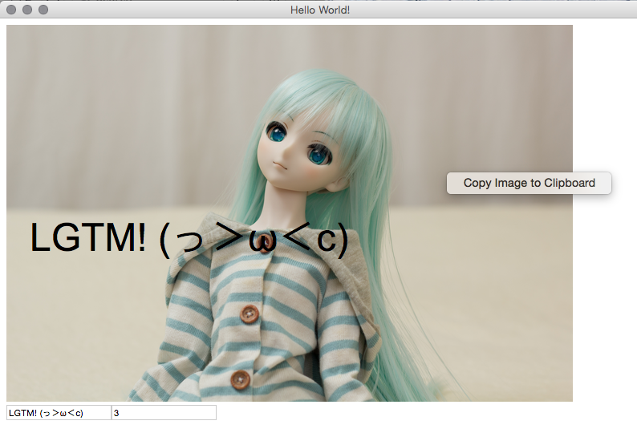

# (っ＞ω＜c)

1. 画像を貼り付ける
2. LGTM とかの文字をオーバライド
3. 右クリックで画像をクリップボードにコピー
4. Slack とか github に貼り付ける

### 良さ ≡└(┐卍^o^)卍

- 画像を保存しないのでどっかのディレクトリがごちゃごちゃにならない
- electron と React.js で作った

### 使い方 ＿|￣| Σ･∴’、-=≡( ՞ਊ ՞)

```sh
npm install electron-prebuilt -g
git clone <this repo>
cd <this repo>
electron .
```

### SS (´ . .̫ . `)


