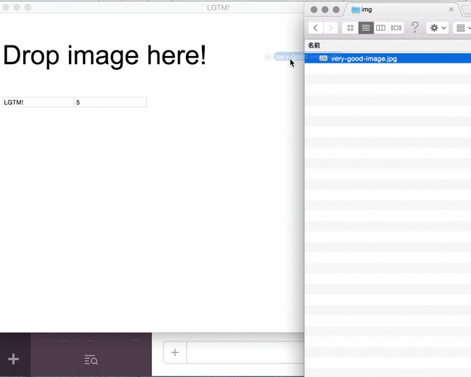

# (っ＞ω＜c)

1. メニューバーから起動する
2. 以下の方法のどれかで画像を貼り付ける
 - D & D
 - 右クリックでクリップボードからペースト
 - 画像 URL から読み込み
3. LGTM とかの文字をオーバライド
4. 右クリックで画像をクリップボードにコピー
5. Slack とか github に貼り付ける

### 良さ ≡└(┐卍^o^)卍

- 画像を保存しないのでどっかのディレクトリがごちゃごちゃにならない
- electron と React.js で作った
- メニューバーに常駐してる

### 使い方 ＿|￣| Σ･∴’、-=≡( ՞ਊ ՞)

```sh
npm install electron-prebuilt -g
git clone <this repo>
cd <this repo>
electron .
```

### SS (´ . .̫ . `)



